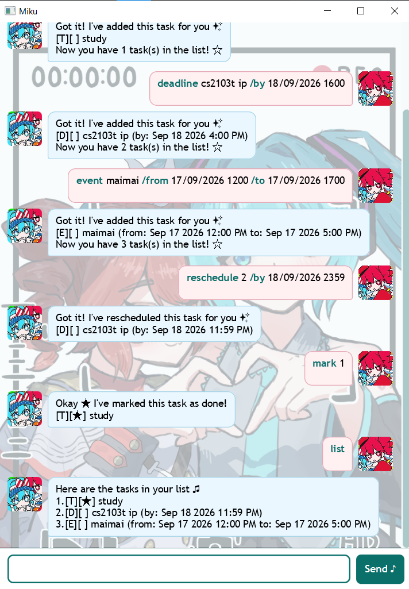

# Miku User Guide ★

Miku is a desktop task tracker with a cheerful chat interface. Create to-dos, deadlines, and events; Miku saves your changes automatically for the next session.



## Quick start

### 1. Install Java 25

Miku requires Java 25. In a terminal, run:

```powershell
java -version
```

The output should report Java 25. On macOS, run `sdk use java 25.0.3.fx-zulu` first if you manage Java with SDKMAN.

### 2. Start Miku

Download the release `miku.jar`, open a terminal in the folder that contains it, and run:

```powershell
java -jar miku.jar
```

The same command works on Windows, macOS, and Linux when Java 25 is active.

Miku opens with a greeting and a command field. Type a command, then press <kbd>Enter</kbd> or select **Send ♪**. Your commands appear on the right and Miku's replies appear on the left.

### 3. Try a complete session

Enter these commands one at a time:

```text
todo revise notes
deadline cs2103t ip /by 2026-09-16 1600
event project meeting /from 2026-09-20 1400 /to 2026-09-20 1530
list
mark 1
reschedule 2 /by 2026-09-16 2359
find project
```

The commands create three tasks, complete the first task, update the deadline, and search the list. Use `list` whenever you need the complete, numbered task list. ★

## Commands

Commands are lowercase and case-sensitive.

| Command | Description |
| --- | --- |
| `todo <description>` | Adds an undated task. |
| `deadline <description> /by <date or time>` | Adds a task due on a date or at a time. |
| `event <description> /from <start> /to <end>` | Adds a task with a start and end schedule. |
| `list` | Displays every task in list order. |
| `find <keyword>` | Displays tasks whose descriptions contain the keyword. |
| `mark <number>` | Marks a task as complete. |
| `unmark <number>` | Marks a task as incomplete. |
| `delete <number>` | Removes a task. |
| `reschedule <number> ...` | Changes a deadline or event schedule. |
| `bye` | Shows a farewell and closes Miku after one second. |

### Add a to-do

Use `todo` for work that has no date or time.

```text
todo buy concert tickets
```

Miku adds the task to the end of the list as `[T][ ] buy concert tickets`. A to-do description cannot be empty.

### Add a deadline

Use `deadline` with `/by` followed by a valid date or date-time.

```text
deadline submit report /by 2026-10-03
deadline pay invoice /by 3/10/2026 1730
```

Deadlines use the marker `[D]`. Miku displays a date-only deadline as `Oct 03 2026`, and one with a time as `Oct 03 2026 5:30 PM`.

### Add an event

Use `event` with both `/from` and `/to` markers.

```text
event team rehearsal /from 2026-10-05 1800 /to 2026-10-05 2030
event study week /from 6/10/2026 /to 10/10/2026
```

Events use the marker `[E]`. The end cannot be earlier than the start; equal start and end date-times are accepted. Each endpoint can independently be a date or a date-time.

### List tasks

Use `list` to see every task and its current number.

```text
list
```

Example output:

```text
Here are the tasks in your list ♪
1.[T][ ] revise lecture notes
2.[D][ ] submit assignment (by: Sep 25 2026 11:59 PM)
3.[E][ ] project meeting (from: Sep 20 2026 2:00 PM to: Sep 20 2026 3:30 PM)
```

Use numbers from `list` with `mark`, `unmark`, `delete`, and `reschedule`.

### Find tasks

Use `find` to search task descriptions. Searches ignore letter case and match any part of the description.

```text
find project
```

Miku shows matching tasks in their original order. Its filtered display renumbers matches from 1, so those numbers are for viewing only. Before changing a search result, run `list` and use that task's list number. ♪

### Mark or unmark a task

Use the task number from `list`.

```text
mark 1
unmark 1
```

Completed tasks display `★`, for example `[T][★]`; incomplete tasks display `[T][ ]`.

### Delete a task

Use the task number from `list`.

```text
delete 3
```

Miku removes the selected task, saves the shortened list, and moves later tasks up one number.

### Reschedule a deadline or event

Only deadlines and events can be rescheduled. Use the form that matches the selected task type:

```text
reschedule 2 /by 2026-10-04 0900
reschedule 3 /from 2026-10-06 1000 /to 2026-10-06 1130
```

Rescheduling retains the description and completion status. A to-do cannot be rescheduled. A deadline requires `/by`; an event requires both `/from` and `/to`.

### Exit Miku

```text
bye
```

Miku displays its farewell, disables the command field, and closes shortly afterwards. ✨

## Dates and times

Use these formats wherever a command asks for a date or time:

| Input format | Example | Display format |
| --- | --- | --- |
| `yyyy-MM-dd` | `2026-09-25` | `Sep 25 2026` |
| `d/M/yyyy` | `25/9/2026` | `Sep 25 2026` |
| `yyyy-MM-dd HHmm` | `2026-09-25 1730` | `Sep 25 2026 5:30 PM` |
| `d/M/yyyy HHmm` | `25/9/2026 1730` | `Sep 25 2026 5:30 PM` |

`HHmm` is a four-digit 24-hour time: `0900` is 9:00 AM, `1200` is noon, and `2359` is 11:59 PM. Miku checks calendar dates, times, and event ranges.

## Saving and recovering

Miku saves additions, completion changes, deletions, and reschedules to `data/miku.json` in the folder where you launch it, then restores that file at startup.

If the file is missing, Miku starts with an empty list. If it cannot read or validate the file, it reports the problem in the chat and starts an empty list. Invalid commands and task fields show an `OOPS!!!` message without closing the app, so you can correct the command and continue.

## Build a runnable JAR

Create a self-contained JAR with:

```powershell
./gradlew.bat shadowJar
java -jar build/libs/miku.jar
```

On macOS or Linux, replace `./gradlew.bat` with `./gradlew`. The JAR contains Miku's runtime dependencies and can be launched with Java 25 from any folder.
